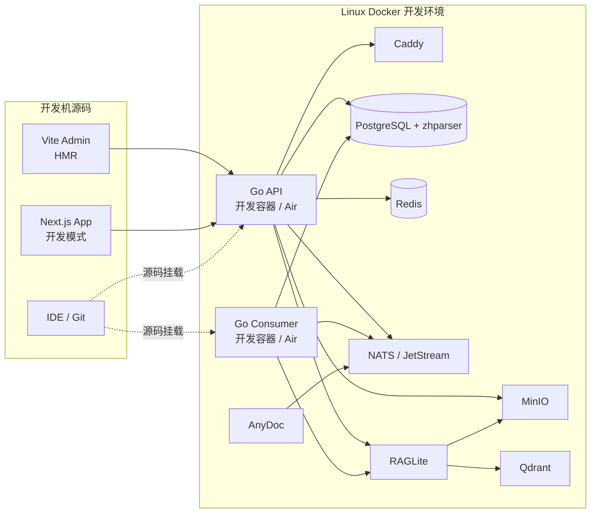

# PandaWiki 二次开发部署方式分析与推荐方案

> 如果希望通过脚本完成首次部署、源码拉取、镜像构建、按服务更新、启停和回滚，请优先阅读 [PandaWiki 一键脚本部署与二开更新](./PANDAWIKI_SCRIPTED_DEPLOYMENT.md)。本文后续内容保留为原理说明和手工排障参考。

> 适用对象：准备对 PandaWiki 进行二次开发，但暂时没有 PostgreSQL、Redis、NATS、MinIO、Qdrant 等中间件搭建经验的开发者。
>
> 分析依据：当前 PandaWiki 仓库、线上一键安装 Compose、后端配置和前端构建方式。
>
> 分析时间：2026-08-30。

## 1. 最终结论

不建议你现阶段采用“全部源码、所有中间件手工安装”的方式，也不建议直接修改一键安装生成的官方 Compose 文件。

在你可以接受每次重新打包镜像的前提下，最适合当前阶段的是：

> **完整系统全部使用 Docker。中间件继续使用官方镜像，修改哪个业务服务就重新构建哪个镜像，再通过 Compose 定向替换容器。**

这会牺牲一部分热更新速度，但环境最接近官方部署，也最适合暂时不熟悉中间件的开发者：

| 部分                           | 推荐运行方式                           | 原因                                                   |
| ------------------------------ | -------------------------------------- | ------------------------------------------------------ |
| PostgreSQL、Redis、NATS、MinIO | Docker                                 | 无需学习原生安装、用户权限和数据目录配置               |
| Qdrant、RAGLite、AnyDoc        | Docker                                 | 依赖关系多，且项目已有匹配版本镜像                     |
| Caddy                          | Docker                                 | PandaWiki 会通过 Caddy Admin Socket 动态配置知识库站点 |
| Go API、Consumer               | 自行构建 Docker 镜像                   | 避免宿主机路径、证书和 Caddy Socket 兼容问题           |
| Admin 管理端                   | 先构建静态产物，再构建 Nginx 镜像      | 与官方交付方式一致                                     |
| App 用户端                     | 先执行 Next.js Build，再构建 Node 镜像 | 验证 SSR 和 standalone 生产行为                        |
| 最终联调/发布验证              | 全 Docker                              | 确保行为和实际交付环境一致                             |

开发时保留官方 Compose 中的 PostgreSQL、Redis、NATS、MinIO、Qdrant、RAGLite、AnyDoc 和 Caddy，只替换 `api`、`consumer`、`nginx`、`app` 四个业务镜像。镜像使用版本化 Tag，便于定位和回滚。

## 2. 为什么 PandaWiki 不适合直接“全源码裸跑”

PandaWiki 不是只有一个 Go 服务和一个数据库。完整功能依赖以下组件：

```text
PandaWiki API
├── PostgreSQL
├── Redis
├── MinIO
├── NATS / JetStream
├── RAGLite
│   ├── PostgreSQL
│   ├── Qdrant
│   ├── MinIO
│   └── NATS
├── AnyDoc / Crawler
│   ├── NATS
│   └── MinIO
└── Caddy Admin Socket

PandaWiki Consumer
├── PostgreSQL
├── NATS
├── RAGLite
└── Cron 定时任务
```

如果全部源码或原生方式部署，你需要自己完成：

- PostgreSQL 用户、数据库、扩展和数据目录配置。
- Redis 密码、AOF/RDB 持久化配置。
- MinIO Bucket、访问密钥和对象策略配置。
- NATS 用户、JetStream、持久化目录配置。
- Qdrant API Key 和存储配置。
- RAGLite 与 PostgreSQL、Qdrant、MinIO、NATS 的连接配置。
- AnyDoc 与 NATS、MinIO 的连接配置。
- Caddy Admin API、Unix Socket、端口和证书配置。
- 服务启动顺序、重启策略、日志和数据备份。

这会把你的主要精力从“修改 PandaWiki”转移到“学习和维护基础设施”。

## 3. 当前源码直接运行还存在的项目约束

### 3.1 后端默认配置面向容器网络

后端默认使用以下服务名或固定地址：

```text
panda-wiki-postgres:5432
panda-wiki-redis:6379
panda-wiki-minio:9000
169.254.15.13:4222  # NATS
169.254.15.18:5050  # RAGLite
```

直接在宿主机运行 Go API 时，这些容器内地址通常不可访问，需要完整覆盖环境变量。

### 3.2 API 启动时依赖容器路径

API 启动会检查并生成证书，当前路径写死为：

```text
/app/etc/nginx/ssl/panda-wiki.key
/app/etc/nginx/ssl/panda-wiki.crt
```

普通用户在宿主机源码运行时可能没有 `/app` 写权限。在容器中则已经通过 Volume 提供了对应目录。

### 3.3 Caddy 使用 Unix Socket

默认 Caddy Admin 地址为：

```text
/app/run/caddy-admin.sock
```

后端创建或修改知识库时会通过该 Socket 动态下发域名、端口和反向代理配置。API 在容器中可以直接挂载 Caddy Socket；在 macOS/Windows 宿主机直接访问 Docker VM 内的 Unix Socket 会更麻烦。

### 3.4 PostgreSQL 不是普通官方镜像

一键安装使用带中文检索能力的 `postgres-zhparser` 镜像。直接安装一个普通 PostgreSQL，可能在搜索、扩展或迁移阶段遇到差异。

### 3.5 API 启动包含迁移和外部连接

API/迁移程序会执行：

- SQL Schema Migration。
- Go 业务数据迁移。
- 创建/检查 `raglite` 数据库。
- 初始化管理员和证书。
- 连接 Redis、MinIO、NATS、RAGLite。
- 同步知识库配置到 Caddy。

任意依赖配置错误，都可能导致 API 无法正常启动。

因此，当前仓库更偏向“在完整容器环境内运行”，而不是开箱即用的宿主机全源码开发。

## 4. 三种方案对比

### 4.1 方案 A：全部使用一键 Docker 部署

执行官方一行命令，直接运行当前发布镜像。

#### 优点

- 对没有中间件经验的人最简单。
- 版本、网络、密码、数据目录自动配置。
- 可以最快获得一个能登录、能创建知识库的基准环境。
- 与官方部署方式接近，适合功能体验和问题对照。
- 数据统一保存在安装目录，停止和备份相对直观。

#### 缺点

- 运行的是官方镜像，不是你当前工作区的源码。
- 修改代码后，需要重新构建镜像并替换容器。
- 前端每次构建完整镜像的反馈速度慢。
- 容器日志和调用链比直接源码调试更绕。
- 不适合高频断点调试。

#### 适合场景

- 第一次体验 PandaWiki。
- 只需要使用，不修改代码。
- 作为二开前后的功能对照环境。
- 发布前完整部署验证。

### 4.2 方案 B：全部使用源码和原生中间件部署

在宿主机安装全部依赖，再分别运行 Go、Next.js 和 Vite。

#### 优点

- 调试链路直接。
- 可以使用 IDE 断点和本地性能分析。
- 修改代码后的反馈速度快。
- 不需要反复构建业务镜像。

#### 缺点

- 需要手工维护至少 7 类中间件/基础服务。
- 容易出现版本和配置偏差。
- macOS/Windows 与 Linux 生产环境差异明显。
- Caddy Unix Socket 和 `/app` 证书路径需要额外改造。
- RAGLite、Qdrant、AnyDoc 的依赖关系容易成为排障瓶颈。
- 很难复现其他开发者和生产环境的问题。

#### 适合场景

- 已熟悉全部中间件。
- 有成熟的内部开发环境脚本。
- 只调试某个完全隔离、无需完整系统的 Go 包。

#### 当前是否推荐

不推荐。你目前没有搭建中间件的经验，投入和风险都高于收益。

### 4.3 方案 C：Docker 中间件 + 源码开发

使用 Docker Compose 管理基础服务，让业务代码以源码或开发容器方式运行。

#### 优点

- 不需要手工安装中间件。
- 中间件版本与官方环境保持一致。
- 前端可以使用 Vite/Next.js 热更新。
- Go 后端可以在开发容器中使用 Air 热更新。
- 环境可以删除和重建，问题更容易复现。
- 最终仍能切换到完整 Docker 做发布验证。

#### 缺点

- 需要额外准备开发 Compose 和开发 Dockerfile。
- 需要理解容器网络、端口和 Volume 的基本概念。
- 第一次配置比直接一键安装多一些工作。

#### 当前是否推荐

如果追求最高开发反馈速度，这仍是最平衡的方案；但你已经明确可以接受每次打包镜像，因此当前最终方案选择“全 Docker + 定向重建业务镜像”，实施更简单、环境也更一致。

## 5. 可选的热更新架构（当前暂不采用）

本节保留为后续提效选项。当前阶段不需要 Air、源码 Volume 或宿主机前端服务，直接参考第 10、11 节的全 Docker 方案。



### 为什么后端也建议放进开发容器

- 与生产同为 Linux。
- 可以直接使用 `/app/run` 和 `/app/etc/nginx/ssl`。
- 可以挂载 Caddy Admin Unix Socket。
- 直接使用 Compose 服务名连接中间件。
- 不需要把数据库、Redis、NATS 等端口全部暴露到宿主机。
- 使用源码 Volume + Air 后，仍然可以自动重新编译和重启。

## 6. 可选热更新方案实施步骤（当前暂不采用）

### 6.1 先建立官方基准环境

准备一台 Linux 开发服务器或 Linux 虚拟机，执行官方一键安装。

目的不是直接在这套环境里改代码，而是：

- 确认服务器网络和 Docker 正常。
- 熟悉登录、创建知识库、配置模型和导入文档的正常流程。
- 获得一套“未修改源码”的行为基准。
- 确认所需镜像可以正常下载。

建议把它命名为“基准环境”，不要写入重要生产数据。

### 6.2 建立独立开发 Compose

不要直接修改一键安装目录里的生产 Compose。建议在仓库增加：

```text
deploy/dev/
├── compose.yml
├── .env.example
├── Dockerfile.api.dev
├── Dockerfile.consumer.dev
└── README.md
```

开发 Compose 可以基于官方 Compose，但需要做以下调整：

1. 数据目录改成独立的 `data-dev/`。
2. API 和 Consumer 使用开发 Dockerfile。
3. 将仓库 `backend/` 挂载到 Go 开发容器。
4. 使用 Air 或同类工具监听 Go 文件变化。
5. 保留 Caddy Socket 和证书目录挂载。
6. 为需要从宿主机访问的服务选择性映射端口。
7. 增加 PostgreSQL、Redis、NATS、MinIO、Qdrant、RAGLite Healthcheck。
8. 给 API/Consumer 增加依赖健康等待逻辑。

### 推荐只映射的开发端口

| 服务          | 容器端口              | 是否建议暴露 | 用途                 |
| ------------- | --------------------- | ------------ | -------------------- |
| Admin         | 5173 或 Vite 实际端口 | 是           | 本机浏览器访问       |
| App           | 3010                  | 是           | 本机浏览器访问       |
| API           | 8000                  | 是           | 前端代理、接口调试   |
| MinIO Console | 9001                  | 可选         | 查看对象文件         |
| PostgreSQL    | 5432                  | 可选         | IDE 数据库工具       |
| Redis         | 6379                  | 可选         | Redis 调试工具       |
| NATS          | 4222                  | 通常不需要   | 后端容器内部访问即可 |
| Qdrant        | 6333                  | 通常不需要   | RAGLite 内部访问即可 |
| RAGLite       | 5050                  | 可选         | 单独排查 RAG 接口    |

映射到宿主机的中间件端口应绑定 `127.0.0.1`，不要直接开放到公网。

### 6.3 前端源码运行

在开发机安装 Node.js 和 pnpm，然后：

```bash
cd web
pnpm install
pnpm dev
```

这会并行启动 Admin 和 App。也可以分别启动：

```bash
cd web/admin
pnpm dev
```

```bash
cd web/app
pnpm dev
```

Admin 通过 Vite Proxy 访问 API；App 通过 `TARGET`、Next.js Rewrite/Proxy 访问后端。

### 6.4 后端开发容器热更新

开发 Dockerfile 建议：

- 基于 Go 1.24.3。
- 安装 Air。
- 挂载 `backend/` 源码。
- Go Build Cache 和 Module Cache 使用命名 Volume。
- API 监听 8000。
- Consumer 使用独立服务运行，避免与 API 混在一个进程。

典型开发命令可以封装为：

```bash
docker compose -f deploy/dev/compose.yml up -d
docker compose -f deploy/dev/compose.yml logs -f api consumer
```

修改 Go 文件后由 Air 自动编译和重启，无需每次手工构建生产镜像。

### 6.5 发布前全 Docker 验证

准备生产风格镜像：

```bash
cd backend
docker build -f Dockerfile.api -t panda-wiki-api:dev .
docker build -f Dockerfile.consumer -t panda-wiki-consumer:dev .
```

前端先执行生产构建，再使用对应 Dockerfile 打包。最后用一份生产风格 Compose 替换官方镜像标签，验证：

- 数据库迁移。
- 首次安装和已有数据升级。
- API/Consumer 重启。
- SSE 流式聊天。
- 文件上传和 MinIO 下载。
- 文档向量化和 RAG 检索。
- Caddy 域名、端口和证书。

## 7. 推荐的环境变量组织

### 7.1 Docker 内运行后端

后端容器可以继续使用服务名：

```dotenv
PG_DSN=host=postgres user=panda-wiki password=<password> dbname=panda-wiki port=5432 sslmode=disable TimeZone=Asia/Shanghai
MQ_NATS_SERVER=nats://nats:4222
REDIS_ADDR=redis:6379
S3_ENDPOINT=minio:9000
RAG_CT_RAG_BASE_URL=http://raglite:5050
CADDY_API=/app/run/caddy-admin.sock
POSTGRES_PASSWORD=<password>
NATS_PASSWORD=<password>
REDIS_PASSWORD=<password>
S3_SECRET_KEY=<password>
JWT_SECRET=<password>
ADMIN_PASSWORD=<password>
ENV=local
```

实际服务名需要与开发 Compose 保持一致。

### 7.2 Admin 源码运行

`web/admin/.env.local` 建议包含：

```dotenv
TARGET=http://127.0.0.1:8000
SHARE_TARGET=http://127.0.0.1:8000
STATIC_FILE_TARGET=http://127.0.0.1:9000
```

如果静态文件通过 Nginx/Caddy 访问，应把 `STATIC_FILE_TARGET` 改成对应入口地址。

### 7.3 App 源码运行

`web/app/.env.local` 可以包含：

```dotenv
TARGET=http://127.0.0.1:8000
STATIC_FILE_TARGET=http://127.0.0.1:9000
DEV_KB_ID=<开发知识库ID>
```

`DEV_KB_ID` 用于开发环境没有 Caddy 自动注入 `X-KB-ID` 时指定当前知识库。

### 7.4 密钥处理

- 开发环境使用独立随机密码。
- `.env`、`.env.local` 不提交 Git。
- 仓库只提供 `.env.example`，不填写真实密钥。
- 开发、测试、生产环境不要共用密码和数据目录。

## 8. 根据修改范围选择最省事的方式

### 只修改 Admin 管理端

推荐：

```text
完整后端：官方 Docker 环境
Admin：重新执行 Vite Build 并打包 Nginx 镜像
App：继续使用原镜像
```

只替换 `nginx` 容器，不重启 API 和中间件。

### 只修改 App 用户端

推荐：

```text
完整后端：官方 Docker 环境
App：重新执行 Next.js Build 并打包 Node 镜像
Admin：继续使用原镜像
```

只替换 `app` 容器。

### 修改 Go API 业务逻辑

推荐：

```text
中间件：Docker
API：构建新的正式 Docker 镜像
Consumer：建议同步构建，确保共享代码版本一致
前端：没有改动时继续使用原镜像
```

不要直接使用官方 API 镜像，因为它不会包含你的修改。

### 修改异步向量化或文档处理

推荐同时重新构建后端镜像：

```text
API + Consumer：新的版本化镜像
NATS + RAGLite + Qdrant + MinIO + PostgreSQL：Docker
```

重点关注 NATS 消息、Consumer 日志和 RAGLite 文档状态。

### 修改部署、Caddy 或多域名能力

推荐在 Linux 开发服务器上使用完整 Docker 环境。Docker Desktop 的 Host Network 和 Unix Socket 行为与原生 Linux 不完全一致，不适合用来验证最终部署行为。

## 9. 不建议采取的做法

### 不要把所有中间件原生安装到开发机

会产生版本冲突、残留服务和难以迁移的数据目录，后续排障成本高。

### 不要直接在一键安装目录中修改官方 Compose

再次升级时文件可能被覆盖，而且无法区分官方配置和个人修改。应使用独立的 `compose.custom.yml`；不含密码的模板可以保存在代码仓库中，实际文件随安装目录一起备份。

### 不要直接使用生产数据做二开

数据库迁移、文档重新向量化和清理任务都有修改数据的可能。应使用独立开发数据。

### 不要把所有中间件端口暴露到公网

PostgreSQL、Redis、NATS、MinIO、Qdrant 和 RAGLite 应只在内部网络访问。调试端口应绑定到 `127.0.0.1` 或通过 SSH Tunnel 使用。

### 不要把“一次成功启动”当成环境完成

需要验证数据库迁移、NATS 消息、MinIO 上传、RAGLite 检索、SSE 聊天和容器重启后的数据持久化。

## 10. 最终推荐方案

### 当前立即采用

1. 准备一台 Linux 开发服务器或虚拟机。
2. 用官方一键安装部署一套基准环境。
3. 不在该环境存放生产数据。
4. 保留官方中间件镜像和数据卷。
5. 修改源码后，按照第 11 节构建版本化业务镜像并替换对应容器。

### 开始二开时采用

1. 中间件、Caddy 和数据目录继续由官方 Compose 管理。
2. 在安装目录增加一个 Compose Override，只覆盖四个业务服务的 `image`。
3. 后端有改动时构建 API 和 Consumer 镜像。
4. Admin 有改动时先执行 Vite Build，再构建 Nginx 镜像。
5. App 有改动时先执行 Next.js Build，再构建 Node 镜像。
6. 使用 `docker compose up -d --no-deps` 定向替换发生变化的服务。
7. 每次镜像使用独立 Tag，不覆盖旧版本。

### 发布前采用

1. 构建 API、Consumer、Admin、App 正式镜像。
2. 在全新测试环境执行首次部署。
3. 在保留数据的测试环境执行升级部署。
4. 完成全链路验证后再发布。

### 最终架构选择

```text
日常二开：全部 Docker，修改后重新构建并定向替换业务镜像
中间件：始终使用官方镜像，不自行搭建
发布验证：同一套 Compose 全量验证
纯源码裸部署：暂不采用
```

这套方案没有 HMR，但流程清楚、环境一致、回滚直接，也不要求你学习中间件的原生安装，是当前最稳妥的选择。

## 11. 完整 Docker 镜像打包与部署教程

下面按“在 Linux 部署服务器上拉取源码并构建”的方式说明。这是最稳妥的做法，可以避免 macOS ARM、Linux amd64、Next.js 依赖和 Docker Desktop Host Network 之间的差异。

### 11.1 最终需要构建哪些镜像

PandaWiki 的中间件镜像不需要重新构建，只需要构建以下四个业务镜像：

| 源码改动                    | 需要构建的镜像 | Compose 服务名        |
| --------------------------- | -------------- | --------------------- |
| `backend/`                | API、Consumer  | `api`、`consumer` |
| `web/admin/` 或前端共享包 | Admin Nginx    | `nginx`             |
| `web/app/` 或前端共享包   | Next.js App    | `app`               |

后端 API 镜像中同时包含迁移程序。启动 API 容器时执行：

```text
panda-wiki-migrate → panda-wiki-api
```

因此更新 API 镜像时可能同时执行数据库迁移。

### 11.2 推荐的构建机器

推荐直接在安装 PandaWiki 的 Linux 开发服务器构建，要求：

- Git。
- Docker 20+，推荐较新的 Docker Engine 和 BuildKit。
- Node.js 20 或 22。
- pnpm 10.12.1。
- 至少 4 GiB 可用内存，构建 Next.js 时建议更多。
- 足够的 Docker 镜像和 pnpm 缓存空间。

Go 后端在 Docker Builder 中编译，宿主机不必为了打镜像单独安装 Go。只有运行测试、Lint 或生成 Wire/Swagger 时才需要宿主机 Go 1.24.3 和相关工具。

### 11.3 确认社区版还是专业版

社区版使用：

```text
backend/Dockerfile.api
backend/Dockerfile.consumer
```

专业版使用：

```text
backend/Dockerfile.api.pro
backend/Dockerfile.consumer.pro
```

专业版源码位于 `backend/pro` Git Submodule。先检查：

```bash
git submodule status backend/pro
```

如果输出前面有 `-`，说明子模块没有初始化。没有专业版仓库权限时，使用社区版 Dockerfile，不要强行使用 `.pro` Dockerfile。

从官方一键安装镜像切换为自行构建的社区版镜像后，专业版接口和功能可能不可用。这不是打包失败，而是版本能力不同。

### 11.4 为本次构建生成唯一版本号

在仓库根目录执行：

```bash
PW_IMAGE_TAG="dev-$(date +%Y%m%d%H%M)-$(git rev-parse --short HEAD)"
PW_IMAGE_NS="pandawiki-local"
export PW_IMAGE_TAG PW_IMAGE_NS
echo "$PW_IMAGE_TAG"
```

示例结果：

```text
dev-202608302130-a1b2c3d
```

不要长期使用 `latest`。唯一 Tag 可以明确知道容器运行的是哪次代码，也方便回滚。

### 11.5 构建前检查代码状态

```bash
git status --short
git rev-parse --short HEAD
docker version
docker compose version
```

未提交改动仍会被 Docker Build Context 打入镜像，因此必须记录 `git status`。Tag 中只有 Git Commit，不能表达未提交内容。

后端改动至少执行受影响包测试；准备正式交付前执行仓库要求的 Lint：

```bash
cd backend
go test ./...
make lint
cd ..
```

`make lint` 会运行生成、格式化和 `go mod tidy`，而且会涉及专业版生成流程。如果没有专业版子模块，应先使用社区版可执行的测试、`make generate` 和 `golangci-lint run`，并记录专业版检查未执行。

### 11.6 什么时候需要重新生成后端代码

普通 Usecase、Repo、Handler 函数内部修改不一定需要生成。

以下情况需要运行：

```bash
cd backend
make generate
cd ..
```

- 修改 Wire Provider 或构造函数依赖。
- 新增 Handler 并需要注入。
- 修改 Swagger 注释或 API 定义。
- `wire_gen.go`、Swagger 文件与源码不一致。

本地需要安装对应版本工具：

```bash
go install github.com/google/wire/cmd/wire@v0.6.0
go install github.com/swaggo/swag/cmd/swag@v1.16.5
```

如果 API 合约变化，还需要在后端 Swagger 可访问的情况下重新生成前端请求客户端：

```bash
cd web
pnpm --filter panda-wiki-admin api
pnpm --filter panda-wiki-app api
cd ..
```

对应的 `web/admin/.env.local`、`web/app/.env.local` 需要正确配置 `SWAGGER_BASE_URL` 和必要的鉴权信息。

### 11.7 构建 API 镜像

从仓库根目录执行社区版构建：

```bash
docker build \
  --build-arg VERSION="$PW_IMAGE_TAG" \
  -f backend/Dockerfile.api \
  -t "$PW_IMAGE_NS/api:$PW_IMAGE_TAG" \
  backend
```

该 Dockerfile 会：

1. 使用 Go 1.24.3 Alpine Builder。
2. 下载 `go.mod`/`go.sum` 依赖。
3. 静态编译 API。
4. 静态编译 Migration 程序。
5. 将二进制和 SQL Migration 复制到 Alpine 运行镜像。
6. 把 `PW_IMAGE_TAG` 写入后端版本变量。

专业版把 Dockerfile 替换为：

```bash
-f backend/Dockerfile.api.pro
```

### 11.8 构建 Consumer 镜像

社区版：

```bash
docker build \
  -f backend/Dockerfile.consumer \
  -t "$PW_IMAGE_NS/consumer:$PW_IMAGE_TAG" \
  backend
```

专业版使用：

```bash
-f backend/Dockerfile.consumer.pro
```

后端的 `domain`、`repo`、`usecase`、`mq` 等包会被 API 和 Consumer 共同编译。即使只修改了一处后端共享代码，最稳妥的方式也是 API、Consumer 使用同一个 Tag 一起构建和部署。

### 11.9 安装前端依赖

前端 Dockerfile 只是“打包已有构建产物”，不会在镜像内运行 pnpm Build。因此必须先生成 `dist`。

```bash
corepack enable
corepack prepare pnpm@10.12.1 --activate
cd web
pnpm install --frozen-lockfile
cd ..
```

必须在 `web/` Workspace 根目录安装依赖，不要分别使用 npm 或 yarn。

### 11.10 构建 Admin 静态产物

通过当前 Shell 的环境变量注入显示版本，不覆盖仓库中的环境文件：

```bash
cd web
VITE_APP_VERSION="$PW_IMAGE_TAG" pnpm --filter panda-wiki-admin build
cd ..
```

验证产物：

```bash
test -f web/admin/dist/index.html
du -sh web/admin/dist
```

然后构建 Nginx 镜像：

```bash
docker build \
  -f web/admin/Dockerfile \
  -t "$PW_IMAGE_NS/nginx:$PW_IMAGE_TAG" \
  web/admin
```

镜像会复制：

- `dist/` 到 `/opt/frontend/dist`。
- `server.conf` 和 `nginx.conf`。
- 仓库中的默认 SSL 证书目录。

Compose 启动时还会把安装目录中的 `data/nginx/ssl` 覆盖挂载到容器证书目录。

### 11.11 构建 App standalone 产物

App 服务端需要通过 Docker 网络访问 API。仓库当前 `web/app/.env` 已配置：

```dotenv
TARGET=http://panda-wiki-api:8000
```

构建前确认该值没有被错误改成只在构建机上有效的地址：

```bash
grep '^TARGET=' web/app/.env
```

执行 Next.js Build：

```bash
cd web
TARGET=http://panda-wiki-api:8000 pnpm --filter panda-wiki-app build
cd ..
```

`next.config.ts` 配置了：

```text
distDir: dist
output: standalone
```

验证 Dockerfile 需要的目录：

```bash
test -d web/app/dist/standalone
test -d web/app/dist/static
test -d web/app/public
du -sh web/app/dist
```

构建 App 镜像：

```bash
docker build \
  -f web/app/Dockerfile \
  -t "$PW_IMAGE_NS/app:$PW_IMAGE_TAG" \
  web/app
```

运行镜像使用 Node 22 Alpine、非 root 用户，并执行：

```text
node app/server.js
```

如果启用了 Sentry Source Map 上传，需要在前端 Build 阶段配置 `SENTRY_AUTH_TOKEN`。没有上传需求时不要把该 Token 写入 Dockerfile 或提交到仓库。

### 11.12 一次构建全部四个镜像

完整顺序如下：

```bash
PW_IMAGE_TAG="dev-$(date +%Y%m%d%H%M)-$(git rev-parse --short HEAD)"
PW_IMAGE_NS="pandawiki-local"
export PW_IMAGE_TAG PW_IMAGE_NS

docker build --build-arg VERSION="$PW_IMAGE_TAG" \
  -f backend/Dockerfile.api \
  -t "$PW_IMAGE_NS/api:$PW_IMAGE_TAG" backend

docker build \
  -f backend/Dockerfile.consumer \
  -t "$PW_IMAGE_NS/consumer:$PW_IMAGE_TAG" backend

corepack enable
corepack prepare pnpm@10.12.1 --activate
cd web
pnpm install --frozen-lockfile
VITE_APP_VERSION="$PW_IMAGE_TAG" pnpm --filter panda-wiki-admin build
TARGET=http://panda-wiki-api:8000 pnpm --filter panda-wiki-app build
cd ..

docker build -f web/admin/Dockerfile \
  -t "$PW_IMAGE_NS/nginx:$PW_IMAGE_TAG" web/admin

docker build -f web/app/Dockerfile \
  -t "$PW_IMAGE_NS/app:$PW_IMAGE_TAG" web/app
```

确认四个镜像都存在：

```bash
docker image inspect \
  "$PW_IMAGE_NS/api:$PW_IMAGE_TAG" \
  "$PW_IMAGE_NS/consumer:$PW_IMAGE_TAG" \
  "$PW_IMAGE_NS/nginx:$PW_IMAGE_TAG" \
  "$PW_IMAGE_NS/app:$PW_IMAGE_TAG" >/dev/null

docker image ls "$PW_IMAGE_NS/*"
```

### 11.13 使用 Compose Override 替换官方业务镜像

下面以一键安装的常见默认目录 `/data/pandawiki` 为例；如果安装时选择了其他目录，必须替换为实际路径。进入安装目录：

```bash
cd /data/pandawiki
```

新建 `compose.custom.yml`，不要直接修改官方 `docker-compose.yml` 的镜像字段：

```yaml
services:
  api:
    image: pandawiki-local/api:${PW_IMAGE_TAG}
  consumer:
    image: pandawiki-local/consumer:${PW_IMAGE_TAG}
  nginx:
    image: pandawiki-local/nginx:${PW_IMAGE_TAG}
  app:
    image: pandawiki-local/app:${PW_IMAGE_TAG}
```

在安装目录 `.env` 中增加或更新：

```dotenv
PW_IMAGE_TAG=dev-202608302130-a1b2c3d
```

不要删除 `.env` 中已有的数据库、中间件和管理员密码。

先检查 Compose 合并后的镜像列表：

```bash
docker compose \
  -f docker-compose.yml \
  -f compose.custom.yml \
  config --images
```

应确认 `api`、`consumer`、`nginx`、`app` 使用自定义镜像，中间件仍使用官方镜像。不要把完整的 `docker compose config` 输出保存或发给他人，其中可能包含 `.env` 中的密码。

### 11.14 部署前备份

二开环境也建议在第一次替换 API 前备份。最简单且一致性较好的方式是停机备份整个安装目录：

```bash
cd /data/pandawiki
docker compose -f docker-compose.yml -f compose.custom.yml down
tar -czf "../pandawiki-backup-$(date +%Y%m%d%H%M).tar.gz" \
  .env docker-compose.yml compose.custom.yml data
```

然后重新启动：

```bash
docker compose -f docker-compose.yml -f compose.custom.yml \
  up -d --pull never
```

注意：

- 不要执行 `docker compose down -v`。
- 数据量大时，完整 Tar 会耗时且占空间。
- 生产环境应使用 PostgreSQL `pg_dump`、对象存储备份和卷快照，而不是只依赖目录 Tar。

API 镜像可能执行向上迁移。镜像回滚不等于数据库自动回滚，因此数据库备份非常重要。

### 11.15 定向部署新镜像

先单独更新 API：

```bash
docker compose \
  -f docker-compose.yml \
  -f compose.custom.yml \
  up -d --no-deps --pull never api
```

观察迁移和 API 启动：

```bash
docker compose \
  -f docker-compose.yml \
  -f compose.custom.yml \
  logs -f --tail=200 api
```

确认 API 不再重启后，更新其余服务：

```bash
docker compose \
  -f docker-compose.yml \
  -f compose.custom.yml \
  up -d --no-deps --pull never consumer nginx app
```

`--no-deps` 可以避免重建 PostgreSQL、Redis、NATS 等中间件；`--pull never` 强制使用本机已经构建的镜像，避免 Compose 到远端查找 `pandawiki-local`。

如果只修改一个服务，只更新对应容器。例如只更新 Admin：

```bash
docker compose -f docker-compose.yml -f compose.custom.yml \
  up -d --no-deps --pull never nginx
```

### 11.16 部署后验证

检查容器和镜像：

```bash
docker compose -f docker-compose.yml -f compose.custom.yml ps

docker inspect panda-wiki-api \
  --format '{{.Config.Image}} {{.State.Status}} {{.State.RestartCount}}'
docker inspect panda-wiki-consumer \
  --format '{{.Config.Image}} {{.State.Status}} {{.State.RestartCount}}'
docker inspect panda-wiki-nginx \
  --format '{{.Config.Image}} {{.State.Status}} {{.State.RestartCount}}'
docker inspect panda-wiki-app \
  --format '{{.Config.Image}} {{.State.Status}} {{.State.RestartCount}}'
```

查看关键日志：

```bash
docker compose -f docker-compose.yml -f compose.custom.yml \
  logs --tail=200 api consumer nginx app
```

至少完成以下功能验证：

1. `https://服务器IP:2443` 可以访问。
2. 管理员能够登录。
3. 知识库列表可以读取。
4. 新建或修改文档成功。
5. 文件可以上传到 MinIO。
6. Consumer 能收到向量任务。
7. RAGLite 文档最终进入可检索状态。
8. Wiki 用户端可以打开。
9. AI 问答的 SSE 流式响应正常。
10. 重启 API/Consumer 后系统仍正常。

### 11.17 只构建发生变化的镜像

| 改动范围                                  | 构建和部署建议                                          |
| ----------------------------------------- | ------------------------------------------------------- |
| 仅`web/admin`                           | Build Admin → Build`nginx` → 只更新 `nginx`       |
| 仅`web/app`                             | Build App → Build`app` → 只更新 `app`             |
| `web/packages/*`                        | Admin 和 App 都可能受影响，建议构建两个前端镜像         |
| 仅 API Handler                            | 最少构建 API；为共享代码一致性建议 API、Consumer 同 Tag |
| `usecase`、`domain`、`repo`、`mq` | 构建 API 和 Consumer                                    |
| 数据库 Migration                          | 构建 API，部署前必须备份数据库                          |
| Swagger/API 合约                          | 生成后端文档和前端客户端，再构建相关全部镜像            |

### 11.18 回滚镜像

假设上一版本是：

```text
dev-202608301800-1122334
```

把安装目录 `.env` 中的 `PW_IMAGE_TAG` 改回旧 Tag，然后执行：

```bash
docker compose -f docker-compose.yml -f compose.custom.yml \
  up -d --no-deps --pull never api consumer nginx app
```

再次检查镜像名和日志。

回滚限制：

- 前端镜像一般可以直接回滚。
- 未改变数据结构的后端通常可以直接回滚。
- 如果新 API 已执行不可逆数据库迁移，仅回滚镜像可能无法恢复；需要使用部署前数据库备份。

### 11.19 构建机和部署机不是同一台时

有两种传递镜像的方式。

#### 方式一：私有镜像仓库

给镜像添加仓库地址并推送：

```bash
PW_REGISTRY="registry.example.com/pandawiki"

docker tag "$PW_IMAGE_NS/api:$PW_IMAGE_TAG" \
  "$PW_REGISTRY/api:$PW_IMAGE_TAG"
docker tag "$PW_IMAGE_NS/consumer:$PW_IMAGE_TAG" \
  "$PW_REGISTRY/consumer:$PW_IMAGE_TAG"
docker tag "$PW_IMAGE_NS/nginx:$PW_IMAGE_TAG" \
  "$PW_REGISTRY/nginx:$PW_IMAGE_TAG"
docker tag "$PW_IMAGE_NS/app:$PW_IMAGE_TAG" \
  "$PW_REGISTRY/app:$PW_IMAGE_TAG"

docker login registry.example.com
docker push "$PW_REGISTRY/api:$PW_IMAGE_TAG"
docker push "$PW_REGISTRY/consumer:$PW_IMAGE_TAG"
docker push "$PW_REGISTRY/nginx:$PW_IMAGE_TAG"
docker push "$PW_REGISTRY/app:$PW_IMAGE_TAG"
```

部署机上的 Override 改用仓库完整地址，然后先执行 `docker compose pull api consumer nginx app`。

#### 方式二：导出镜像文件

构建机执行：

```bash
docker save \
  "$PW_IMAGE_NS/api:$PW_IMAGE_TAG" \
  "$PW_IMAGE_NS/consumer:$PW_IMAGE_TAG" \
  "$PW_IMAGE_NS/nginx:$PW_IMAGE_TAG" \
  "$PW_IMAGE_NS/app:$PW_IMAGE_TAG" \
  | gzip > "pandawiki-images-$PW_IMAGE_TAG.tar.gz"
```

传到部署机后导入：

```bash
gzip -dc "pandawiki-images-$PW_IMAGE_TAG.tar.gz" | docker load
```

然后按前面的 Compose Override 流程部署。

### 11.20 在 Apple Silicon Mac 上构建 Linux 镜像

如果必须在 ARM Mac 构建并部署到 amd64 Linux，后端可以使用 Buildx：

```bash
docker buildx build \
  --platform linux/amd64 \
  --build-arg VERSION="$PW_IMAGE_TAG" \
  -f backend/Dockerfile.api \
  -t "$PW_IMAGE_NS/api:$PW_IMAGE_TAG" \
  --load backend
```

其他镜像同理增加：

```text
--platform linux/amd64 --load
```

但现有前端 Dockerfile 不会在容器里执行 pnpm Build，App standalone 产物是在宿主机生成的。为避免潜在的 Node 原生依赖架构差异，仍推荐在 Linux 构建机生成前端 `dist`，或后续把前端 Dockerfile 改造成完整多阶段构建。

### 11.21 常见打包问题

#### `COPY dist` 失败

原因：还没有执行前端 Build，或在错误目录构建。

检查：

```bash
ls web/admin/dist
ls web/app/dist/standalone
ls web/app/dist/static
```

#### App 容器提示找不到 `app/server.js`

原因：Next.js standalone 产物结构不符合 Dockerfile 预期。确认是在 `web` Workspace 中执行 Build，且 `output: 'standalone'` 没有被删除。

#### 后端构建提示缺少 Wire Provider

运行：

```bash
cd backend
make generate
```

并确认新的 `wire_gen.go` 已生成。

#### `.pro` Dockerfile 找不到源码

原因：`backend/pro` 子模块未初始化或没有权限。改用社区版 Dockerfile，或获取权限后初始化子模块。

#### API 容器持续重启

首先查看：

```bash
docker logs --tail=300 panda-wiki-api
```

重点检查数据库迁移、PostgreSQL、Redis、MinIO、NATS、RAGLite 和 Caddy Socket 错误。不要反复删除数据库目录尝试修复。

#### Compose 仍使用官方镜像

执行：

```bash
docker compose -f docker-compose.yml -f compose.custom.yml config --images
```

确认 Override 文件顺序在官方 Compose 后面，并确认 `.env` 中 `PW_IMAGE_TAG` 正确。

#### 镜像架构不匹配

错误通常包含 `no matching manifest` 或 `exec format error`。检查：

```bash
uname -m
docker image inspect "$PW_IMAGE_NS/api:$PW_IMAGE_TAG" \
  --format '{{.Architecture}}/{{.Os}}'
```

构建时为目标服务器设置正确的 `--platform`。

#### Next.js Build 内存不足

增加构建机内存或临时设置合适的 Node Heap：

```bash
NODE_OPTIONS=--max-old-space-size=4096 \
  TARGET=http://panda-wiki-api:8000 \
  pnpm --filter panda-wiki-app build
```

### 11.22 推荐的日常发布节奏

```text
修改源码
  → 运行测试/Lint
  → 生成唯一镜像 Tag
  → 构建受影响镜像
  → 备份数据（涉及后端或迁移时）
  → Compose Override 定向更新
  → 查看 API/Consumer 日志
  → 完成功能验证
  → 保留上一个 Tag 用于回滚
```

## 12. 可选的后续工程化改进

如果后续觉得手工命令太多，可以再把上述流程封装进仓库：

- `scripts/build-images.sh`：接收 Tag 和服务列表，只构建受影响镜像。
- `deploy/compose.custom.yml`：保存业务镜像 Override 模板，不包含任何密码。
- `make image-build`：构建四个业务镜像。
- `make deploy`：校验镜像存在后定向更新容器。
- `make rollback TAG=...`：切换回指定镜像 Tag。
- `scripts/backup.sh`：在后端升级前执行数据库和数据目录备份。
- 将 Admin/App Dockerfile 改造成多阶段构建，减少宿主机 Node 环境差异。
- 在 CI 中依次执行测试、Lint、前端 Build、镜像构建、漏洞扫描和镜像推送。
- 为 API、Consumer 和关键中间件补充 Healthcheck 与自动等待依赖逻辑。
- 定期清理无引用的旧开发镜像，同时至少保留当前版本和上一个可回滚版本。

完成这些设施后，开发者只需要安装 Git、Docker、Node.js 和 pnpm，不需要单独安装任何中间件；如果前端也改造成多阶段 Docker Build，则构建机只需要 Git 和 Docker。
