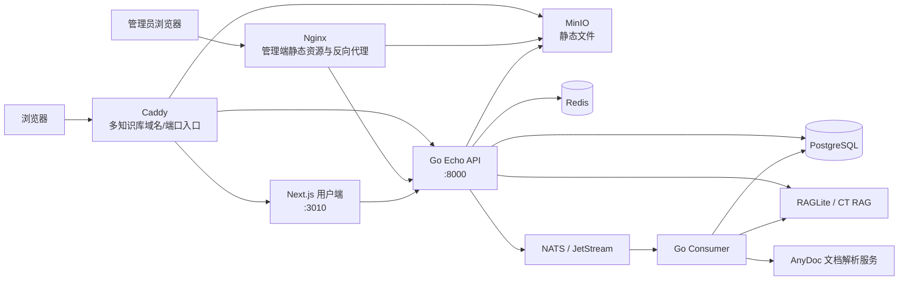

# PandaWiki 技术栈与中间件分析

> 分析依据：仓库当前代码、依赖清单、构建配置和部署文件。  
> 分析时间：2026-08-30。  
> 说明：本文中的“中间件”同时包括 HTTP 请求中间件和 PostgreSQL、Redis、NATS、MinIO、反向代理等基础设施中间件；对“已启用”“条件启用”“仅声明/预留”进行了区分。

## 1. 项目定位与总体架构

PandaWiki 是一个以 AI 大模型和 RAG（检索增强生成）为核心的知识库系统，采用前后端分离、API 服务与异步消费者分离的架构。

- `backend/`：Go 后端，包含 HTTP API、业务用例、数据访问、消息消费、迁移和第三方平台集成。
- `web/admin/`：React + Vite 管理后台，用于知识库、文档、模型、用户、统计等管理功能。
- `web/app/`：Next.js 用户端，用于知识库站点、文档浏览、问答、Widget 和认证页面。
- `web/packages/`：前端共享图标、主题和 UI 包。
- `sdk/rag/`：独立 Go RAG SDK。
- `backend/pro/`：专业版 Git 子模块；当前工作区未初始化，因此无法核验其内部实现。

## 2. 核心技术栈速览

| 层级 | 主要技术 | 仓库中的作用 |
| --- | --- | --- |
| 后端语言 | Go 1.24.3 | API、消费者、迁移、SDK |
| Web 框架 | Echo v4.13.4 | HTTP 路由、请求绑定、校验和中间件 |
| 依赖注入 | Google Wire v0.6.0 | 组装 API、消费者和迁移服务依赖 |
| 配置 | Viper v1.20.1 | 合并默认值、`config.yml` 和环境变量 |
| ORM / 数据库 | GORM v1.26.1 + PostgreSQL | 业务数据持久化和事务处理 |
| 数据迁移 | golang-migrate v4.18.3 + 自定义 Go Migration | SQL Schema 迁移及带业务逻辑的数据迁移 |
| 缓存 / 会话 | Redis + go-redis v9 + redistore | 缓存、轻量锁、API Token 缓存、服务端 Session |
| 消息队列 | NATS v1.42.0 + JetStream | 文档向量化、摘要、抓取和异步任务 |
| 对象存储 | MinIO Go SDK v7 | 上传文件、图片和文档静态资源 |
| AI 编排 | ModelKit v2.14.3 + CloudWeGo Eino v0.7.3 | 多模型适配、Prompt、流式生成、消息 Schema |
| RAG | raglite-go-sdk v0.2.1 | 数据集、文档、模型和检索操作 |
| 管理端 | React 19 + TypeScript 5.9 + Vite 6 | SPA 管理后台 |
| 用户端 | Next.js 16 + React 19 | App Router、服务端渲染、站点代理和 SEO |
| UI | MUI 7 + Emotion + `@ctzhian/ui` | 组件、主题和 CSS-in-JS |
| 可观测性 | `log/slog`、Sentry、OpenTelemetry | 结构化日志、异常采集和链路追踪 |
| API 文档/客户端 | Swaggo + Swagger 客户端生成器 | 生成 Swagger 文档及 TypeScript 请求代码 |
| 交付 | Docker、Nginx、Caddy、GitHub Actions | 多架构镜像、静态服务、动态路由和 CI/CD |

## 3. 后端技术栈

### 3.1 分层结构

后端基本遵循清晰的分层设计：

| 目录 | 职责 |
| --- | --- |
| `handler/` | HTTP 和 MQ 入口，负责协议解析、校验与响应 |
| `usecase/` | 业务逻辑和跨仓储编排 |
| `repo/` | 面向业务的数据访问接口与实现 |
| `store/` | PostgreSQL、Redis、MinIO、RAG、IP 库等底层客户端 |
| `domain/` | 领域模型、请求/响应结构、错误和事件定义 |
| `middleware/` | 认证、权限、会话、只读模式等请求中间件 |
| `server/` | Echo 服务初始化 |
| `cmd/api` | HTTP API 进程入口 |
| `cmd/consumer` | MQ 消费和定时任务进程入口 |
| `cmd/migrate` | 带业务逻辑的数据迁移入口 |

API、Consumer、Migration 各自通过 Wire 生成独立依赖图。API 镜像启动时会先执行迁移程序，再启动 HTTP 服务。

### 3.2 HTTP 与 API

- 使用 Echo 注册 `/api/v1/*` 管理 API 和 `/share/v1/*` 用户端 API。
- 使用 `go-playground/validator` 执行结构体参数校验。
- 自定义 Binder：GET、DELETE、HEAD 只绑定路径和查询参数，其他方法绑定请求体，避免查询参数覆盖 Body。
- 使用 Swaggo 生成 Swagger 文档；仅在 `ENV=local` 时暴露 `/swagger/*`。
- 聊天、文档摘要等场景使用 SSE/流式响应；Nginx 和 Caddy 对相关路径关闭缓冲并延长超时。
- `/share/v1/chat/completions` 提供 OpenAI 风格的流式/非流式兼容接口。

### 3.3 数据与持久化

#### PostgreSQL

- GORM 是主要 ORM，使用 PostgreSQL 驱动。
- 启用了 GORM `TranslateError`，并将慢 SQL 阈值设置为 200 ms。
- 业务模型大量使用 PostgreSQL `jsonb` 存储可变配置和模型参数。
- 初始化时会确保存在单独的 `raglite` 数据库。
- Schema 使用 `backend/store/pg/migration/` 下的 SQL 迁移。
- 复杂的数据修复和业务迁移由 `backend/migration/` 中的 Go Migration 处理，并在事务中记录迁移执行状态。

#### Redis

Redis 不只是普通缓存，还承担以下职责：

- 服务端 Session 存储。
- Session 签名密钥的共享保存。
- API Token、知识库等数据缓存。
- 基于 `SET NX` 的 10 秒轻量分布式锁。
- 统计类临时数据和按前缀清理。

当前锁的释放逻辑是直接 `DEL`，没有校验锁持有者，适合低风险互斥，不适合作为强一致分布式锁。

#### MinIO

- 使用 S3 兼容 MinIO SDK。
- 启动时检查并自动创建 `static-file` Bucket。
- Bucket 策略允许公开读取对象，适合公开知识库静态资源。
- 支持预签名下载 URL。
- 当前客户端固定使用非 TLS 连接（`Secure: false`），部署时应依赖可信内部网络或由网关提供 TLS。

### 3.4 消息队列与异步任务

消息中间件采用 NATS，兼用 Core NATS 和 JetStream：

- JetStream `task` Stream：摘要和向量任务。
- JetStream `scraper` Stream：文档抓取相关主题。
- Stream 使用文件存储，默认最长保留 7 天，容量 1 GiB，最多 100 万条消息，单条最大 50 MiB。
- JetStream Consumer 使用 Durable Consumer、显式 ACK。
- AnyDoc 的导出完成事件使用 Core NATS 订阅，不进入 JetStream 持久流。
- `cmd/consumer` 负责注册 RAG 向量化、文档状态更新等处理器。

消费者进程中还运行 `robfig/cron` 定时任务，包括统计聚合、旧数据清理、RAG 状态同步和发布备份清理。因此当前 Consumer 同时承担消息消费与调度器职责。

### 3.5 AI、LLM 与 RAG

AI 层由三部分组成：

1. **ModelKit**：将领域模型配置转换为统一模型元数据，负责创建不同供应商的 Chat Model。
2. **CloudWeGo Eino**：提供模型接口、Prompt 模板、消息 Schema 和流式生成抽象。
3. **RAGLite / CT RAG**：通过独立 HTTP 服务管理数据集、文档、Embedding/Rerank 模型和语义检索。

主要流程为：读取对话历史 → 构造/改写问题 → 调用 RAG 检索 → 拼接文档上下文 → 调用 LLM → 通过 SSE 返回分片结果 → 记录 Token 用量与会话。

其他相关能力包括：

- `tiktoken-go`：Token 计数与长文档切分。
- HTML 转 Markdown：文档进入 RAG 前进行标准化。
- DeepSeek reasoning 内容解析：将思考内容包装为 `<think>` 块输出。
- 模型类型覆盖 Chat、Embedding、Rerank、Analysis 和多模态 Analysis。

### 3.6 第三方平台集成

仓库中存在以下集成模块：

- 飞书/Lark、钉钉、企业微信、微信公众号/微信客服、Discord 机器人。
- GitHub OAuth 和 LDAP 企业认证。
- AnyDoc 文档解析/抓取，覆盖 URL、飞书、钉钉、Confluence、EPUB、MinDoc、Wiki.js、思源、语雀、Sitemap、RSS、Notion 等来源。
- CAP Proof-of-Work 验证码：后端使用 `go-cap`，用户端使用 `@cap.js/widget`。
- MCP：公共仓库包含设置、统计、网关路径和依赖占位；主要实现预计位于未初始化的 `backend/pro` 子模块，当前无法确认完整运行方式。

## 4. HTTP 请求中间件

### 4.1 全局 Echo 中间件

`NewEcho` 中注册的全局中间件如下：

| 中间件 | 启用条件 | 作用 |
| --- | --- | --- |
| Sentry Echo | `sentry.enabled=true` 且 DSN 非空 | 捕获 Panic、请求异常和上下文 |
| OpenTelemetry Echo | `apm.enabled=true` | 为 Echo 请求创建 Trace Span |
| Request Logger | 始终启用 | 记录 IP、方法、URI、状态码、耗时和错误 |
| ReadOnly | 始终注册，由 `READONLY` 控制 | 只读模式下拒绝 `/api/v1` 的写请求，登录除外 |
| Session | 始终启用 | 将 Redis RediStore Session 注入 Echo Context |

Sentry、OpenTelemetry、日志等全局中间件包裹路由级认证和权限中间件，因此能够覆盖大多数业务请求。

### 4.2 管理 API 认证与授权

管理 API 采用双模式 Bearer 认证：

- Token 包含 `.` 时按 JWT 校验。
- Token 不包含 `.` 时按 PandaWiki API Token 查询和校验。

认证后把统一的 `CtxAuthInfo` 放入请求 Context，路由层继续执行：

- 用户角色校验，例如管理员权限。
- 知识库权限校验，例如文档管理、数据运营、完全控制。
- API Token 与目标知识库的绑定校验。
- 专业版 License Edition 校验。

这种设计把“身份认证”和“资源级权限”分开，路由可以按业务能力组合权限中间件。

### 4.3 用户端知识库认证

用户端依赖网关注入 `X-KB-ID`，再由 `ShareAuthMiddleware` 执行：

- 校验知识库是否禁止访问。
- 未开启认证时直接放行。
- 简单密码或企业认证开启时，从 Redis Session 校验知识库 ID。
- 企业认证额外校验 Session 中的用户 ID。

这说明 `X-KB-ID` 是重要的租户边界字段，生产部署必须防止外部客户端绕过可信网关伪造该请求头。

## 5. 前端技术栈

### 5.1 Monorepo 与共享依赖

- 使用 pnpm 10 Workspace 管理 `admin`、`app` 和 `packages/*`。
- 使用 TypeScript、ESLint 9、Prettier 3。
- Husky + lint-staged 在提交阶段格式化前端文件。
- 共享 `@panda-wiki/icons`、`@panda-wiki/themes`、`@panda-wiki/ui` 三个 Workspace 包。

### 5.2 管理端 `web/admin`

| 类别 | 技术 |
| --- | --- |
| 框架 | React 19、TypeScript |
| 构建 | Vite 6、React Plugin、Rollup Visualizer |
| 路由 | React Router 7 |
| 状态 | Redux Toolkit + React Redux |
| UI | MUI 7、Emotion、`@ctzhian/ui` |
| 编辑器 | `@ctzhian/tiptap`、ProseMirror |
| 拖拽 | dnd-kit |
| 图表 | ECharts |
| 网络 | Axios + Fetch/ReadableStream 封装 |
| Markdown | react-markdown、remark/rehype、KaTeX、highlight.js |

管理端构建时会自动生成路由列表，并对 React、MUI、ECharts、编辑器、Markdown、Yjs 等依赖手工分包。开发服务器代理 `/api`、`/share` 和 `/static-file`。

Yjs 和 `y-websocket` 已安装并配置了独立 Chunk，但当前协同编辑组件代码整体处于注释状态，因此不能视为已启用的实时协同能力。

### 5.3 用户端 `web/app`

- Next.js 16 App Router + React 19。
- 同时使用服务端组件和客户端组件，服务端负责知识库信息、节点列表、Metadata 和设备判断。
- `proxy.ts` 负责动态 Base Path、首页改写、访问统计、`X-KB-ID` 注入以及 `/share/*` 请求转发。
- 使用原生 Fetch、ReadableStream、AbortController 处理聊天流式响应和取消。
- 使用 React Context 管理站点、主题、节点树、认证等共享状态。
- 使用 MUI Next.js App Router Cache Provider 处理 Emotion SSR 样式。
- 支持 Markdown、GFM、数学公式、代码高亮、Mermaid、图片预览和 HTML 转图片。
- 生产构建使用 `output: 'standalone'`，便于精简 Node 容器部署。

### 5.4 API 客户端

- 后端通过 Swaggo 生成 Swagger 描述。
- Admin 生成 `/api/v1` 请求客户端，App 生成 `/share/v1` 请求客户端。
- 专业版 API 生成到各自的 `src/request/pro`。
- SSE 等非标准 JSON 请求使用独立 Fetch/ReadableStream 包装，不强行修改生成客户端。

## 6. 基础设施与部署中间件

### 6.1 Caddy

Caddy 是用户知识库站点的核心入口网关。后端会通过 Unix Socket 调用 Caddy Admin API，按知识库动态生成：

- 域名和端口监听。
- HTTP/HTTPS 配置和用户证书。
- Host 到知识库的路由映射。
- `X-KB-ID` 请求头注入。
- API、Next.js 和 MinIO 的反向代理。
- SSE 路由的即时刷新与长超时。
- 可信代理列表。

这使“知识库访问配置”同时存在于 PostgreSQL 和 Caddy 运行时配置中，后端负责同步二者。

### 6.2 Nginx

管理端镜像使用 Nginx Alpine：

- 托管 Vite 生成的静态文件。
- SPA 路由回退到 `index.html`。
- 代理 `/api`、`/share` 到 Go API。
- 代理 `/static-file` 到 MinIO。
- 对上传接口放宽到 1000 MiB。
- 对聊天和 AI 文本生成关闭代理缓冲并设置 24 小时超时。

### 6.3 Docker 与 CI/CD

- 后端使用 Go 1.24.3 Alpine 多阶段构建，`CGO_ENABLED=0`，生成静态 API、Consumer 和 Migration 二进制。
- 管理端使用 Nginx Alpine 镜像。
- 用户端使用 Node 22 Alpine 非 root 用户运行 standalone 产物。
- GitHub Actions 使用 Buildx + QEMU 构建 amd64/arm64 镜像并推送阿里云容器镜像仓库。
- 后端 PR 会运行 golangci-lint、`go mod tidy --diff`、`go mod verify` 和多架构镜像构建。
- 前端 CI 使用 Node 20，而生产 App 镜像使用 Node 22；如果依赖使用 Node 版本相关能力，应额外关注环境一致性。

仓库中没有 Docker Compose/Kubernetes 清单，完整的 PostgreSQL、Redis、NATS、MinIO、Caddy、RAGLite 和 AnyDoc 编排应位于外部安装/部署项目中。

## 7. 可观测性与运维能力

### 7.1 日志

- 基于 Go 标准库 `log/slog`，输出 TextHandler 格式。
- 支持模块字段、动态日志级别和结构化属性。
- HTTP 请求日志包含真实 IP、方法、URI、状态码和延迟。
- 业务错误响应包含 `trace_id`，便于关联服务端日志。

### 7.2 Sentry

- 后端通过 Sentry Echo 中间件采集错误。
- Next.js 在客户端、Node Runtime、Edge Runtime 和全局错误页接入 Sentry。
- 用户端启用了 Session Replay：普通会话采样 10%，错误会话采样 100%。
- 生产构建上传 Source Map，并使用 `/monitoring` 隧道路由规避部分广告拦截器。

### 7.3 OpenTelemetry

- Echo 已具备 `otelecho` 请求埋点。
- `backend/apm/trace.go` 实现了 OTLP/gRPC Exporter，支持 TLS/非 TLS Collector。
- 但当前 API/Consumer 的 Wire 依赖图没有引入 `apm.ProviderSet`，仓库中也没有其他 `NewTracer` 调用。因此仅设置 `apm.enabled` 可能只会创建请求 Span，而不会把 Span 导出到 OTLP Collector；该能力目前更接近“实现已存在但启动接线不完整”。

### 7.4 产品遥测

`backend/telemetry` 是产品安装/使用数据上报，与 OpenTelemetry APM 不是同一套机制。API 依赖图会创建该 Client，并定期向外部服务上报安装心跳和聚合数据。部署在隐私或隔离环境时，应单独审查其数据范围、网络策略和关闭机制。

## 8. 关键数据流

### 8.1 文档入库与向量化

1. 管理端创建、上传或抓取文档。
2. API 将业务元数据写入 PostgreSQL，文件写入 MinIO。
3. API 向 NATS 发布向量化任务。
4. Consumer 消费任务并调用 RAGLite 上传/更新文档。
5. RAG 文档状态通过消息或定时任务同步回 PostgreSQL。

### 8.2 用户问答

1. Caddy 根据 Host/端口确定知识库并注入 `X-KB-ID`。
2. Next.js 或 Widget 调用 `/share/v1/chat/*`。
3. Share Auth 校验知识库访问策略和 Session。
4. Usecase 读取会话历史并调用 RAG 检索。
5. ModelKit/Eino 调用配置的大模型。
6. API 通过 SSE 返回思考、正文、引用和错误事件。
7. 对话、反馈、Token 用量和统计写入 PostgreSQL/Redis。

## 9. 架构观察与建议

### 优点

- 后端层次清晰，HTTP、业务、仓储和底层存储边界明确。
- API 与 Consumer 分离，耗时 RAG/解析任务不会阻塞 HTTP 请求。
- Caddy 动态多租户路由与知识库配置结合紧密，适合一套服务承载多个域名和端口。
- 前端针对管理端和用户端选择 Vite SPA 与 Next.js SSR，符合两类产品的不同需求。
- Swagger 生成客户端、Wire 依赖注入、SQL/Go 双迁移机制降低了人工同步成本。

### 值得关注的点

1. **APM 接线不完整**：OTLP Tracer 未进入启动依赖图，需补充初始化和优雅 Shutdown 才能形成完整链路追踪。
2. **租户头信任边界**：`X-KB-ID` 由 Caddy 注入，必须在外部入口清除客户端同名头，且避免 Go API 被公网绕过网关直接访问。
3. **产品遥测开关**：当前遥测 Client 在 API 中固定构造，建议明确告知、配置化启停并记录上报字段。
4. **Redis 锁语义较弱**：释放时未校验持有者，关键并发流程应采用带随机令牌和 Lua 校验的锁实现。
5. **单 Consumer 多职责**：MQ 消费与 Cron 共用一个进程，扩容 Consumer 时可能重复启动定时任务；需要确认任务本身是否具备分布式互斥或幂等性。
6. **公开对象存储策略**：`static-file` Bucket 默认公开读，私有知识库的附件访问控制需要依靠对象隔离、代理鉴权或改用签名 URL。
7. **运行时版本一致性**：前端 CI 为 Node 20，用户端生产镜像为 Node 22，建议统一或建立双版本验证。
8. **预留依赖识别**：Yjs 协同编辑当前未启用，MCP 主要实现不可见；评估功能时应区分依赖已安装与功能已上线。
9. **Sentry 生命周期**：后端的 `sentry.Flush` 目前通过 `defer` 写在 `NewEcho` 构造函数中，会在构造函数返回时执行，而不是进程退出时执行；建议移到应用关闭流程，降低退出前事件丢失风险。

## 10. 主要分析依据

- 后端依赖：`backend/go.mod`
- 配置：`backend/config/config.go`
- HTTP 服务与中间件：`backend/server/http/http.go`、`backend/middleware/`
- 数据与存储：`backend/store/pg/`、`backend/store/cache/`、`backend/store/s3/`
- 消息队列：`backend/mq/nats/`、`backend/handler/mq/`
- AI/RAG：`backend/usecase/llm.go`、`backend/store/rag/`
- Caddy 动态配置：`backend/repo/pg/knowledge_base.go`
- 前端依赖：`web/package.json`、`web/admin/package.json`、`web/app/package.json`
- 前端构建：`web/admin/vite.config.ts`、`web/app/next.config.ts`
- 用户端代理：`web/app/src/proxy.ts`
- 管理端 Nginx：`web/admin/server.conf`
- 容器与流水线：各目录 `Dockerfile*`、`.github/workflows/`
